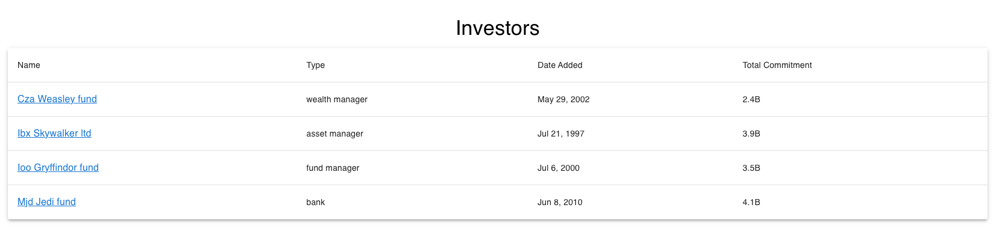
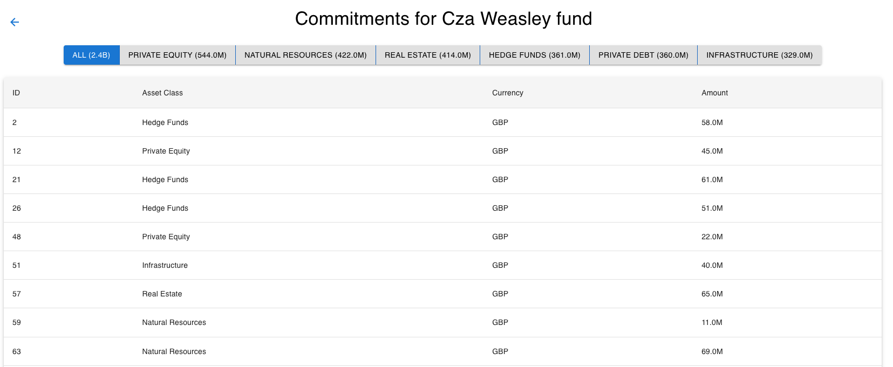

# preqin
Problem statement:
https://bitbucket.org/preqindevelopment/preqin-fullstack-interview-task/src/main/

# Architecture
- Backend: Postgres DMBS
- ORM: sqlAlchemy
- API: FastAPI
- Frontend: React, JavaScript

# Usage
## Virtual Environment
poetry is used to managed dependencies as well as virtual environment

cd into either `frontend` or `backend` and run `eval $(poetry env activate)`

## Installation
- `poetry install`
- `npm run setup`

## Set Up
### .env file
- Create .env at root level with following values and format:
```
DB_NAME="investors"
DB_USER="leehaowei"
DB_PASSWORD=yourpassword
DB_HOST="localhost"
DB_PORT="5432"

TABLE_NAME="investor_table"

REACT_APP_API_BASE_URL=http://localhost:8000
```

### backend
- `cd backend`
- `poetry install`
- `eval $(poetry env activate)`
- Run in psql `CREATE DATABASE investors`, manually create investors database
- Run `setup.py`, this will import the csv into the postgres database

## Run
### Running backend
- `cd backend`
- `uvicorn main:app --reload` ASGI web server

### Running frontend
- `cd frontend`
- `npm start`

# Results
## Investors Page

## Investor Commitment Page


# Limitations
## Data Size
There is no pagination/search capabilities, as it is designed for the current data.csv size

## Testing
There is limited coverage, did not cover main pages